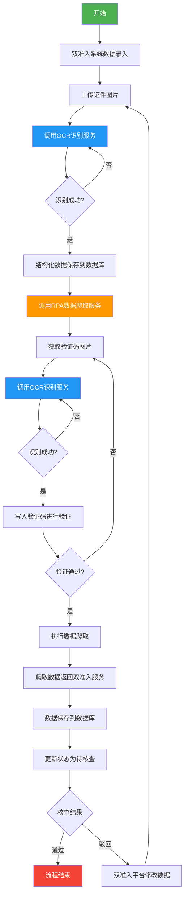

```mermaid
graph TD
    A[开始] --> B[双准入系统数据录入]
    B --> C[上传证件图片]
    C --> D[调用OCR识别服务]
    D --> E{识别成功?}
    E -->|是| F[结构化数据保存到数据库]
    E -->|否| D
    F --> G[调用RPA数据爬取服务]
    G --> H[获取验证码图片]
    H --> I[调用OCR识别服务]
    I --> J{识别成功?}
    J -->|是| K[写入验证码进行验证]
    J -->|否| I
    K --> L{验证通过?}
    L -->|是| M[执行数据爬取]
    L -->|否| H
    M --> N[爬取数据返回双准入服务]
    N --> O[数据保存到数据库]
    O --> P[更新状态为待核查]
    P --> Q{核查结果}
    Q -->|通过| R[流程结束]
    Q -->|驳回| S[双准入平台修改数据]
    S --> C
    style A fill:#4CAF50,color:white
    style R fill:#F44336,color:white
    style D fill:#2196F3,color:white
    style I fill:#2196F3,color:white
    style G fill:#FF9800,color:white
```